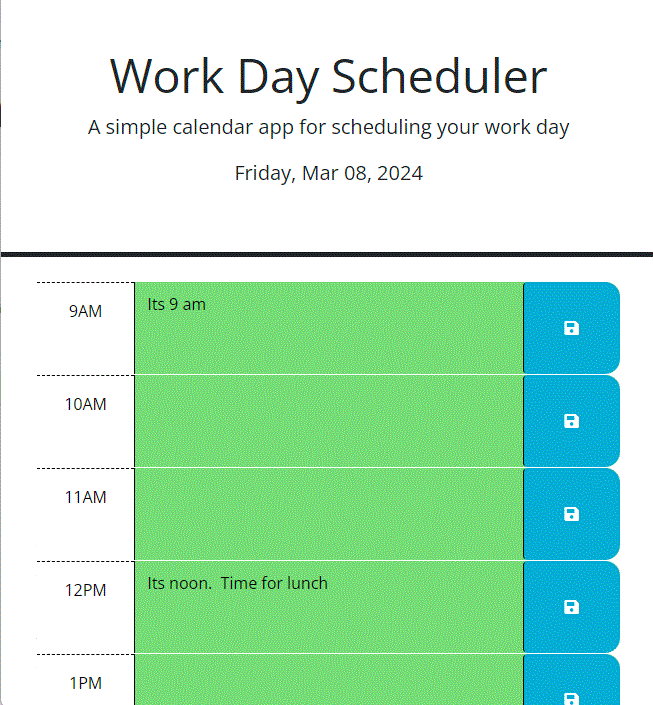

# Work Day Scheduler
Module 5 Challenge

## Description

The repository holds files to create a simple daily planner
  1) The user is presented with a hourly calendar with the ability to add notes
  2) The user saves the information for the hour by clicking on the "save" icon to the right of the text entry area.
  3) Messages are saved to local storage so that the user can close the window and reopen without losing information
  

## Installation

Contains\
  index.html\
  script.js
  

## Screenshot

## Deployed at https://note-taker-pjm-3740623ce2ba.herokuapp.com/notes

## Repository at https://github.com/petemaynard/Note_Taker

## Credits

Created by Pete Maynard
with some assistance from tutor Dru Sanchez
and help from Meredith McDonald

